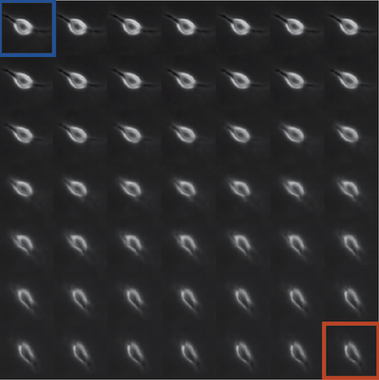
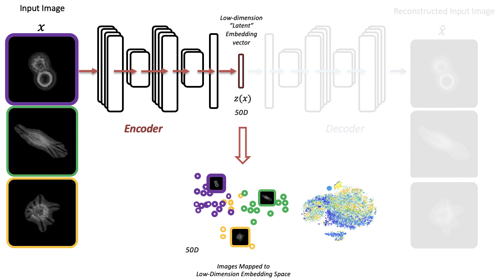
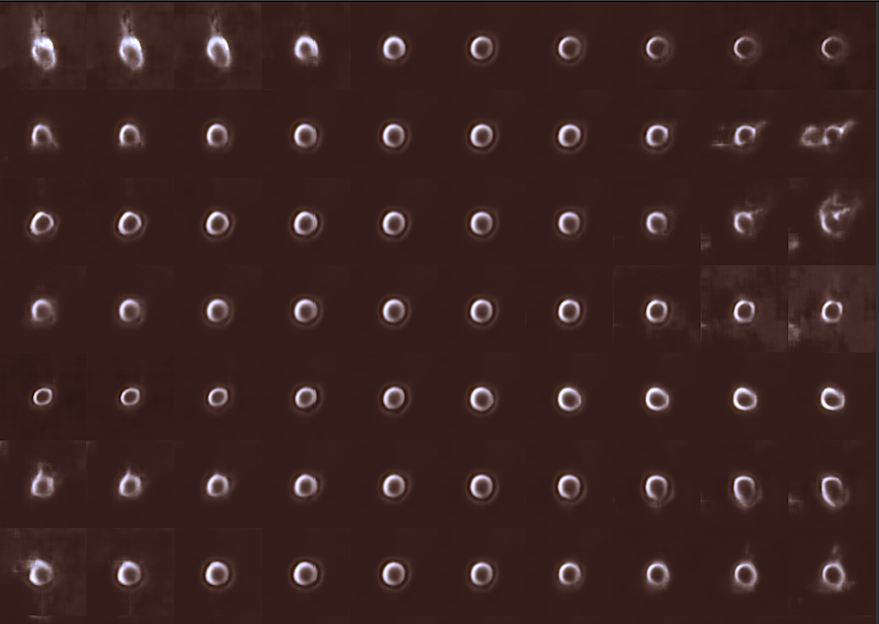
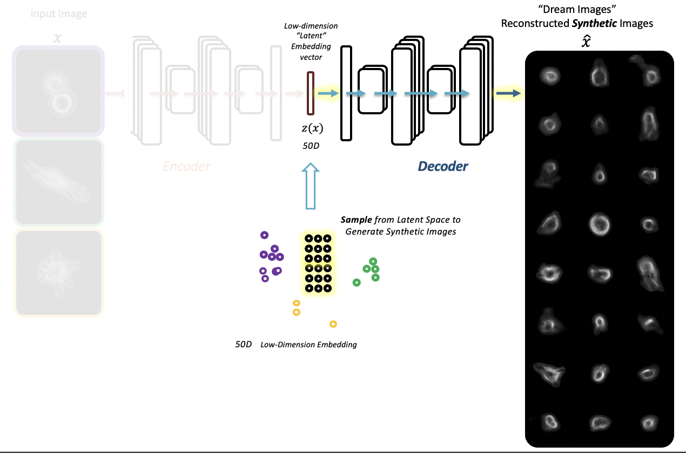

# [Live Cell Histology](https://www.biorxiv.org/content/10.1101/2020.05.15.096628v1)

- Extracting latent features from label-free live cell images using [Adversarial Autoencoders](https://arxiv.org/abs/1511.05644)

#### Manuscript pre-print: https://www.biorxiv.org/content/10.1101/2020.05.15.096628v1 


## Setup & Running Source Code 

Developed and tested on Red Hat Linux 7.

### Installation Steps
- also see more detailed information [here](instructionsToinstallOpenLCH.sh) 
#### Containers

- Set-up compute environment with containers:
    - Install [Singularity](https://sylabs.io/docs/)
	- Tested with Singularity 3.5.3 
	- Need CUDA 8.0+ compatible GPU and drivers (e.g. P100)
	- Pull Singularity container .sif image file from [Singularity Hub](https://singularity-hub.org/)
		- alternatively, a copy can be found [here](https://cloud.biohpc.swmed.edu/index.php/s/a88iQABCbg7SWwi/download)
		- [Definition file](Singularity) provided in this repo  
	- `singularity pull shub://andrewjUTSW/openLCH:latest`
	- Test GPU `singularity exec --nv ./openLCH_latest.sif nvidia-smi`

#### Download and Prepare Example Data

- Download 2000 image sample data set
	- `curl https://cloud.biohpc.swmed.edu/index.php/s/FqZSqoKfHii6ony/download --output sample2000.tar.gz` 
	- unzip data
		- `tar xvzf ./sample2000.tar.gz`
	- Included are a random sample set of 256x256 cell images 
	- Create image file list ```ls `pwd`/data2/*.png > imagePathList.txt```
	- Full data set provided here: <TBD>
	- Download previously trained [autoencoder .t7 file](https://cloud.biohpc.swmed.edu/index.php/s/YAQQtpwTX2NKS89/download)
		- `curl https://cloud.biohpc.swmed.edu/index.php/s/YAQQtpwTX2NKS89/download --output autoencoder_eval_56zTRAINED.t7`
	 
### Run Provided Example Scripts 

#### Linear interpolation between two reconstructed cell images using previously trained AAE
- [interp_LatentSpace_LCH_MD_single_2.lua](code/interp_LatentSpace_LCH_MD_single_2.lua)
```bash
	export LCH_PATH=YOUR_CODE_PATH_HERE
	singularity exec --nv openLCH_latest.sif /bin/bash -c 'cd ./code; \
	th -i ./interp_LatentSpace_LCH_MD_single_2.lua \
	-imPathFile $LCH_PATH/imagePathList.txt \
	-autoencoder $LCH_PATH/autoencoder_eval_56zTRAINED.t7 \
	-outDir $LCH_PATH/output/interpOut/ \
	-gpu 1 \
	-img1 501 \
	-img2 801'
```


#### Train new AAE
- [run_mainLCH_AAE_Train_2.lua](code/run_mainLCH_AAE_Train_2.lua)
```bash
	singularity exec --nv openLCH_latest.sif /bin/bash -c 'cd ./code; \
	th ./run_mainLCH_AAE_Train_2.lua \
	-modelname AAEconv_CLEAN \
	-nLatentDims 56 \
	-imsize 256 \
	-imPathFile $LCH_PATH/imagePathList.txt \
	-savedir $LCH_PATH/outputNew/ \
	-epochs 100 \
	-gpu 1' 
```

#### Extract latent embeddings
- [call_DynComputeEmbeddingsRobust_2.lua](code/call_DynComputeEmbeddingsRobust_2.lua)
```bash 
	singularity exec --nv openLCH_latest.sif /bin/bash -c 'cd ./code; \
	th ./call_DynComputeEmbeddingsRobust_2.lua \
	-autoencoder $LCH_PATH/outputNew/autoencoder_eval.t7 \
	-imsize 256 \
	-dataProvider DynDataProviderRobust_2 \
	-imPathFile $LCH_PATH/imagePathList.txt \
	-gpu 2 \
	-embeddingFile $LCH_PATH/outputNew/embeddings_sampleTest.csv'
```


#### Explore latent space by shifting embedding vector values (one dimension at a time) of an input cell image and reconstructing shifted synthetic cell images
- [exploreZ_LatentSpace_LCH_single_2.lua](code/exploreZ_LatentSpace_LCH_single_2.lua)

```bash
	singularity exec --nv openLCH_latest.sif /bin/bash -c 'cd ./code; \
	th -i ./exploreZ_LatentSpace_LCH_single_2.lua \
	-imPathFile $LCH_PATH/imagePathList.txt \
	-autoencoder $LCH_PATH/autoencoder_eval_56zTRAINED.t7 \
	-outDir $LCH_PATH/outputOrig/zExploreOut \
	-img1 10 \
	-uR 1 \
	-numSteps 6'
```


#### Reconstruct images from latent codes
- [zLatent2ReconBatchLCH_2.lua](code/zLatent2ReconBatchLCH_2.lua)
```bash
	singularity exec --nv openLCH_latest.sif /bin/bash -c 'cd ./code; \
	th -i ./zLatent2ReconBatchLCH_2.lua \
	-autoencoder $LCH_PATH/autoencoder_eval_56zTRAINED.t7 \
	-zLatentFile $LCH_PATH/outputNew/embeddings_sampleTest.csv \
	-reconPath $LCH_PATH/outputNew/zRecon/ \
	-nLatentDims 56'
```


## Citation
```bibtex
@article {Zaritsky2020.05.15.096628,
	author = {Zaritsky, Assaf and Jamieson, Andrew R. and Welf, Erik S. and Nevarez, Andres and Cillay, Justin and Eskiocak, Ugur and Cantarel, Brandi L. and Danuser, Gaudenz},
	title = {Interpretable deep learning of label-free live cell images uncovers functional hallmarks of highly-metastatic melanoma},
	elocation-id = {2020.05.15.096628},
	year = {2020},
	doi = {10.1101/2020.05.15.096628},
	URL = {https://www.biorxiv.org/content/early/2020/05/15/2020.05.15.096628},
	eprint = {https://www.biorxiv.org/content/early/2020/05/15/2020.05.15.096628.full.pdf},
	journal = {bioRxiv}
}
```

#### Inspiration
- https://github.com/AllenCellModeling/torch_integrated_cell/
